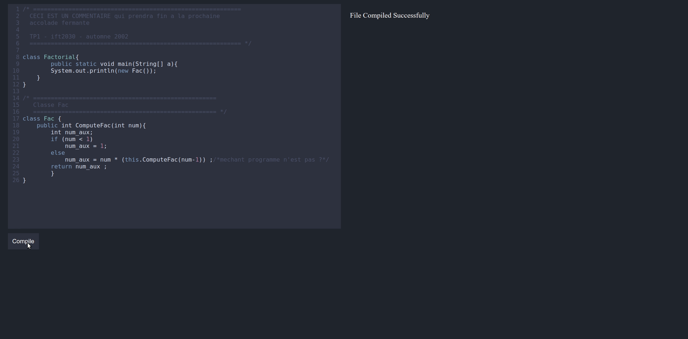
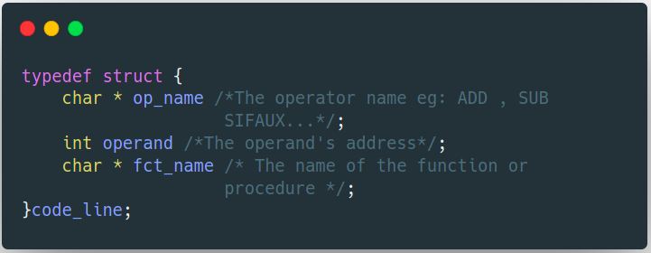
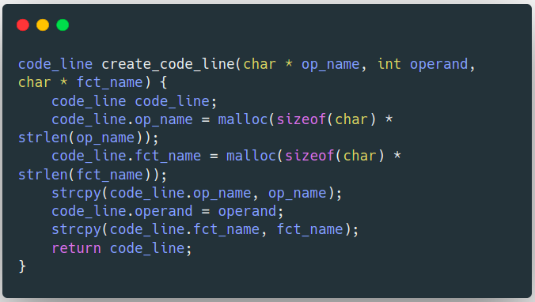
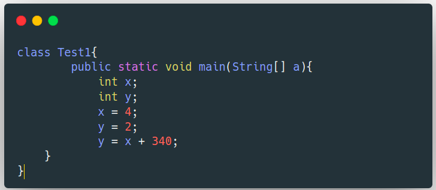
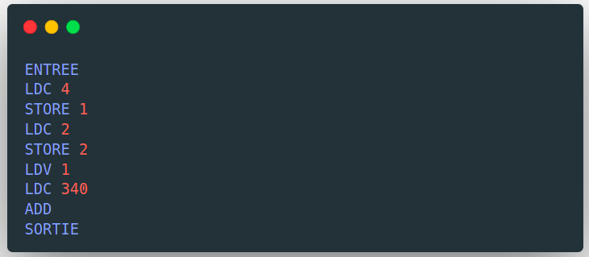
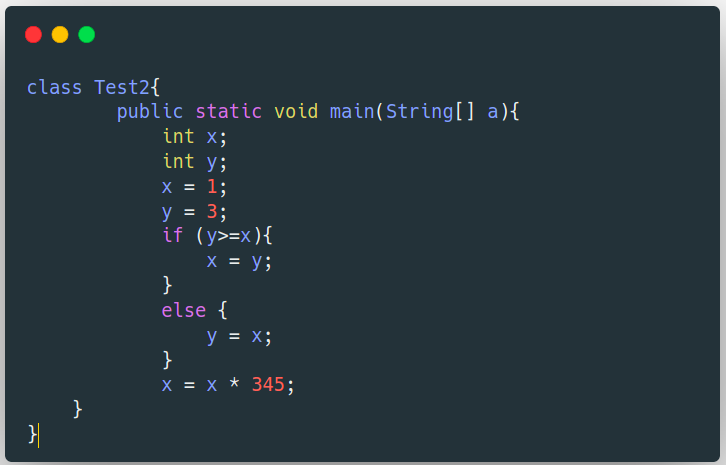
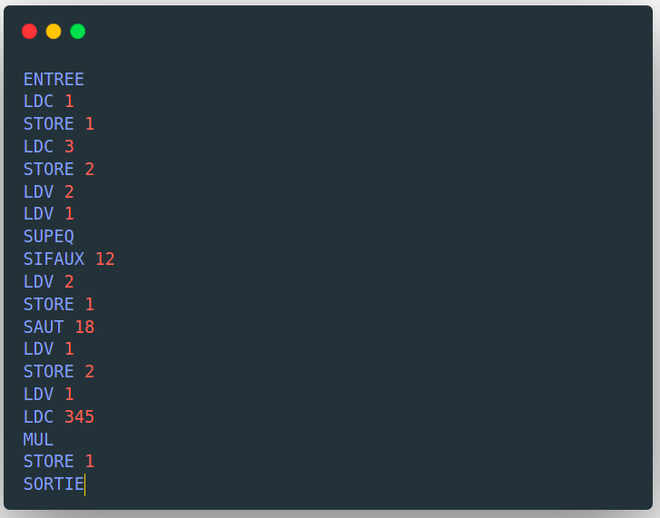

<h3 align="center">Mini Java Compiler</h3>

  <p align="center">
    A mini java compiler.
    <br />
    <a href="https://github.com/Azer-ch/Compilation"><strong>Explore the docs »</strong></a>
    <br />
    <br />
    <a href="#demo">View Demo</a>
    ·
    <a href="https://github.com/Azer-ch/Compilation/issues">Report Bug</a>
    ·
    <a href="https://github.com/Azer-ch/Compilation">Request Feature</a>
  </p>
</div>

<!-- TABLE OF CONTENTS -->
<details>
  <summary>Table of Contents</summary>
  <ol>
    <li>
      <a href="#about-the-project">About The Project</a>
      <ul>
        <li><a href="#built-with">Built With</a></li>
      </ul>
    </li>
    <li>
      <a href="#getting-started">Getting Started</a>
      <ul>
        <li><a href="#prerequisites">Prerequisites</a></li>
        <li><a href="#installation">Installation</a></li>
      </ul>
    </li>
    <li>
    <a href="#demo">Demo</a>
    </li>
    <li>
    <a href="#code-generation">Code generation</a>
    </li>
  </ol>
</details>

<!-- ABOUT THE PROJECT -->

## About The Project

A mini Java compiler , built using Flex and Yacc (also known as Lex and Bison) , is a project that involves implementing a subset of the Java language using the Flex lexical analyzer and Yacc parser generator.

<p align="right">(<a href="#readme-top">back to top</a>)</p>

### Built With

- [![Yacc][Yacc]][Yacc-url]
- [![Flex][Flex]][Flex-url]
- [![Python][Python]][Python-url]

<p align="right">(<a href="#readme-top">back to top</a>)</p>

<!-- GETTING STARTED -->

## Getting Started

To get a local copy up and running follow these simple steps.

### Prerequisites

- python

  1- Update the repositories:

  ```sh
  sudo apt-get update
  ```

  2- Install Python

  ```sh
  sudo apt-get install python
  ```

- virtualenv

  1- Install virtualenv using pip

  ```sh
  pip install virtualenv
  ```

### Installation

1.  Clone the repo
    ```sh
    git clone https://github.com/Azer-ch/Compilation
    ```
2.  Go into the project folder
    ```sh
    cd Compilation
    ```
3.  Create a python virtual environment
    ```sh
    virtualenv compiler
    ```
4.  Start the virtual environment
    ```sh
    source compiler/bin/activate
    ```
5. Install the required libraries
    ```sh
    pip install -r requirements.txt
    ```
6. Start the flask server
    ```sh
    python -m GUI.GUI
    ```
7. Navigate to the url `http://127.0.0.1:5000`
    <p align="right">(<a href="#readme-top">back to top</a>)</p>


### Demo
<p align="center">
  
</p>

## Code generation

The structure for the each instruction:



The method for creation of an instruction:




The method for the insertion of an instruction into the array of code:


### Examples:


Source code             |  Generated Code
:-------------------------:|:-------------------------:
  |  
  |  


### Demo


[linkedin-shield]: https://img.shields.io/badge/-LinkedIn-black.svg?style=for-the-badge&logo=linkedin&colorB=555
[linkedin-url]: https://www.linkedin.com/in/chazer/
[contributors-shield]: https://img.shields.io/github/contributors/Azer-ch/TGL-Mobile.svg?style=for-the-badge
[contributors-url]: https://github.com/Azer-ch/TGL-Mobile/graphs/contributors
[product-screenshot]: images/logo.jpeg
[Yacc-url]: https://www.javatpoint.com/yacc#:~:text=YACC%20stands%20for%20Yet%20Another,by%20LALR%20(1)%20grammar.
[Yacc]: https://img.shields.io/badge/C-00599C?style=for-the-badge&logo=yacc&logoColor=white
[Flex-url]: https://www.geeksforgeeks.org/flex-fast-lexical-analyzer-generator/
[Flex]: https://img.shields.io/badge/C-00599C?style=for-the-badge&logo=flex&logoColor=white
[Python]: https://img.shields.io/badge/Python-3776AB?style=for-the-badge&logo=python&logoColor=white
[Python-url]: https://www.python.org/
